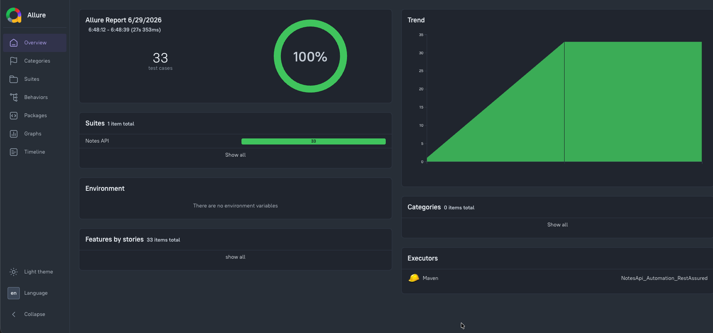
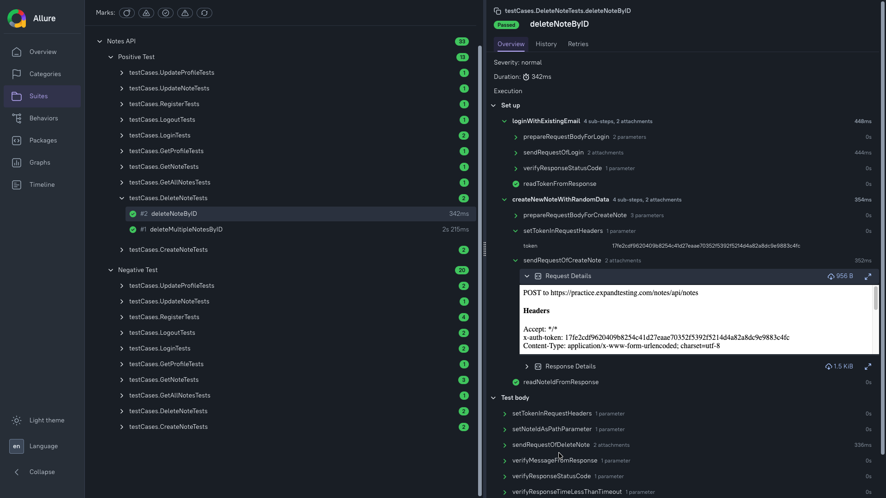

# Notes API Automation Framework

API Test Automation Framework developed using Java and Rest Assured to automate testing of Notes API endpoints.

## Project Overview

This project automates Notes API with Positive and Negative test cases for each Endpoint and Validate E2E cenarios for CRUD operations on Notes, within an Automation Framework

## Allure Report
### Generate and Open Allure Report easily in one step by running Open_Allure_Report.bat file


### Positive Tests & Negative Tests


## Technologies Used

- Rest Assured with Java
- Maven Project
- TestNG as Testing Framework
- Request/Response Object Model Design Pattern
- Test Reporting using Allure
- Logging using Log4j2
- Remote Execution on CI Pipeline using GitHub Actions
- Test Data Management using Json
- Test Data Generation using JavaFaker

## Endpoints
- Register new User
- Login & Logout
- Update Profile
- Get Profile
- Create New Note
- Update Note
- Get All Notes
- Get Note by ID
- Delete Note

## Features
- Using Request/Response Object Model, by setting two classes for each endpoint:

  - Request Model Class that contains all Methods performed on Request, such as :
    - Set Request Body and Content Type (Json and form data)
    - Set Request Headers
    - Set Request Parameters for Get (Path Parameters and Query Parameters)
    - Set Request Authorization
    - Send the Request


  - Response Model Class that contains all Methods performed on Request, such as :
    - Validate on Status Code
    - Validate on any data from Response Body by TestNG Assertion
    - Getters to get any data from Response Body by JsonPath


- Create Generic Methods that can be reused in Sending any types of API Requests for any Project, which takes the following inputs:
  - Api Method
  - Api Url
  - Request Body and Content Type either **Json** or **FormData** in case of "Post / Put / Patch / Delete"
  - Request Parameters either **PathParameters** or **QueryParameters** in case of "Get"
  - Request Headers
  - It returns the API Response


- Allure Report for Reporting All Test Results & Logging All Test Steps & Uploading all Requests/Response Sent
- Local Execution using TestNG xml file
- Remote Execution using CI Pipeline on GitHub Actions
- Auto Generation of Allure Report after Test Run

## CI Pipeline
  

## Utilities
- API Manager for sending all API Requests and different validations on Responses
- Data Generator for generating different Test Data
- Json Reader for reading Test Data from Json Files using JsonPath
- Properties Reader for reading Project Configurations from Properties Files
- LogHelper for Logging Info , Warning and Error Steps with Log4j2

## Project Structure
```text
NotesAPI-ApiAutomation-RestAssured
│
├── .github
│   └── workflows
│       └── RunApiTests.yml
│
├── src
│   ├── main
│   │   ├── java
│   │   │   └── utils
│   │   │       ├── APIsManager.java
│   │   │       ├── AllureReportHelper.java
│   │   │       ├── DataGenerator.java
│   │   │       ├── JsonReader.java
│   │   │       ├── LogHelper.java
│   │   │       └── PropertiesReader.java
│   │   │
│   │   └── resources
│   │       ├── allure.properties
│   │       ├── log4j2.properties
│   │       └── settings.properties
│   │
│   └── test
│       ├── java
│       │   ├── apiObjectModels
│       │   │   ├── Register_RequestModel.java
│       │   │   ├── Register_ResponseModel.java
│       │   │   ├── Login_RequestModel.java
│       │   │   ├── Login_ResponseModel.java
│       │   │   ├── CreateNote_RequestModel.java
│       │   │   ├── CreateNote_ResponseModel.java
│       │   │   └── ...
│       │   │
│       │   └── testCases
│       │       ├── BaseTest.java
│       │       ├── RegisterTests.java
│       │       ├── LoginTests.java
│       │       ├── CreateNoteTests.java
│       │       ├── GetAllNotesTests.java
│       │       └── ...
│       │
│       └── resources
│           ├── TestData.json
│           │
│           └── TestNG_Suites
│               ├── PositiveTestCases.xml
│               ├── NegativeTestCases.xml
│               ├── RunAllTests.xml
│               ├── RunAllTests_2.xml
│               └── RunSingleTest.xml
│
├── Open_Allure_Report.bat
├── pom.xml
├── README.md
└── .gitignore
```
## Running Tests
### Run all tests using Maven:
```bash
mvn clean test
```
### Run all tests using TestNG Xml
- RunAllTests.xml

### Run positive and negative groups using Maven
```bash
mvn clean test -Dgroups=positive
```

```bash
mvn test -Dgroups=negative
```
### Run positive and negative groups using Maven
- PositiveTestCases.xml
- NegativeTestCases.xml

## Author

Hadeer Atef

Software Testing Engineer

GitHub:
https://github.com/HadeerAtef96
